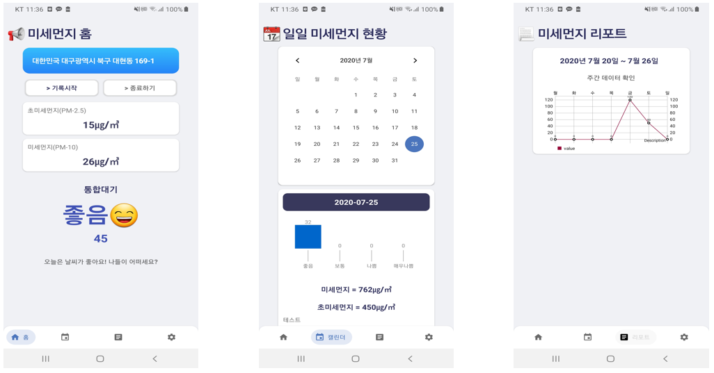

<h1 align="center">
  KF96
</h1>

  

<h3 align="center"> 현재 위치와 공공데이터를 이용하여 미세먼지 정보 제공과 캘린더 저장 및 시각화</h3>

# 📋 기능
✔ 　실시간 초미세먼지, 미세먼지 정보 제공    
✔ 　통합대기 정보 제공  
✔ 　10분을 주기로 미세먼지 노출량 캘린더에 저장  
✔ 　캘린더를 이용하여 사용자의 일일 미세먼지 노출량 정보 제공  
✔ 　사용자의 주간 미세먼지 노출 데이터 시각화  

# 🎬 데모 영상
https://www.youtube.com/watch?v=Nw1NLM3C418&feature=youtu.be

# 🚀 사용한 공공데이터  
한국환경공단_측정소정보 (https://www.data.go.kr/tcs/dss/selectApiDataDetailView.do?publicDataPk=15000660)  
한국환경공단_대기오염정보 (https://www.data.go.kr/tcs/dss/selectApiDataDetailView.do?publicDataPk=15000581)  
제3회 정부혁신제안끝장개발대회(http://civichack.or.kr/?)
  
